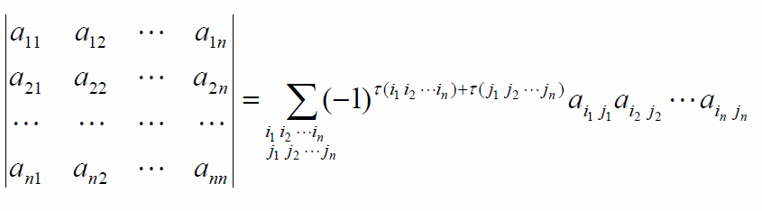

# 从线性方程组求解引入行列式
## 使用消元法求解方程组
  * 将解表达成两个行列式的比值
   
# 行列式的计算
## 二元行列式的计算
## 三元行列式的计算
## n元行列式的计算
### 排列的定义
### 逆排序的定义
### 排列中对换的定义及对排列奇偶性的影响
### n元行列式的计算
#### 行号依次递增

#### 列好依次递增

#### 不考虑行号列号递增

### n元行列式的计算

## 行列式的性质
### 性质1 行列式与它的转置行列式相等
### 性质2 互换行列式的两行（列）， 行列式变号
#### 推论 如果行列式有两行（列）完全相同， 则此行列式等于0
### 性质3 行列式的某一行（列）中所有的元素都乘以同一数k, 等于用数k乘此行列式
#### 推论 行列式某一行（列）的所有元素的公因子可以提到行列式记号的外面
### 性质4 行列式中如果有两行（列）元素成正比，则此行列式等于零
### 性质5 若行列式的某一行（列）的元素都是两数之和，则D等于两个行列式之和
### 性质6 把行列式的某一列（行）的各元素乘以同一数然后加到另一列（行）对应的元素上，行列式不变

# 行列式按行展开
## 定义
### 余子式
### 代数余子式
## 定理
### 引理 一个n阶行列式， 如果其中第i行所有元素除（i, j）元aij外都为零， 那么这行列式等于aij与它的代数余子式的乘积，即D=aijAij
### 定理3 行列式等于它的任一行（列）的各元素与其对应的代数余子式乘积之和
这个定理叫做行列式按行（列）展开法则
#### 推论 行列式某一行（列）的元素与另一行（列）的对应元素的代数余子式乘积之和等于零。

# 克拉默法则
如果线性方程组的系数行列式不等于零，那么方程组有唯一解

## 定理4 如果线性方程组的系数行列式D != 0，则方程组一定有解，且解是唯一的

### 定理4的逆定理 如果线性方程组无解或者有两个不同的解，则它的系数行列式必为零
线性方程组右端的常系数不全为零， 线性方程组叫做非齐次线性方程组。当常系数全为零时，线性方程组叫做齐次线性方程组

## 定理5 如果齐次线性方程组的系数行列式D!=0,则齐次线性方程组没有非零解
      如果齐次线性方程组有非零解，则它的系数行列式必为零

### 参考资料
 * 线性代数 刘鹏 复旦大学通信科学与工程系
